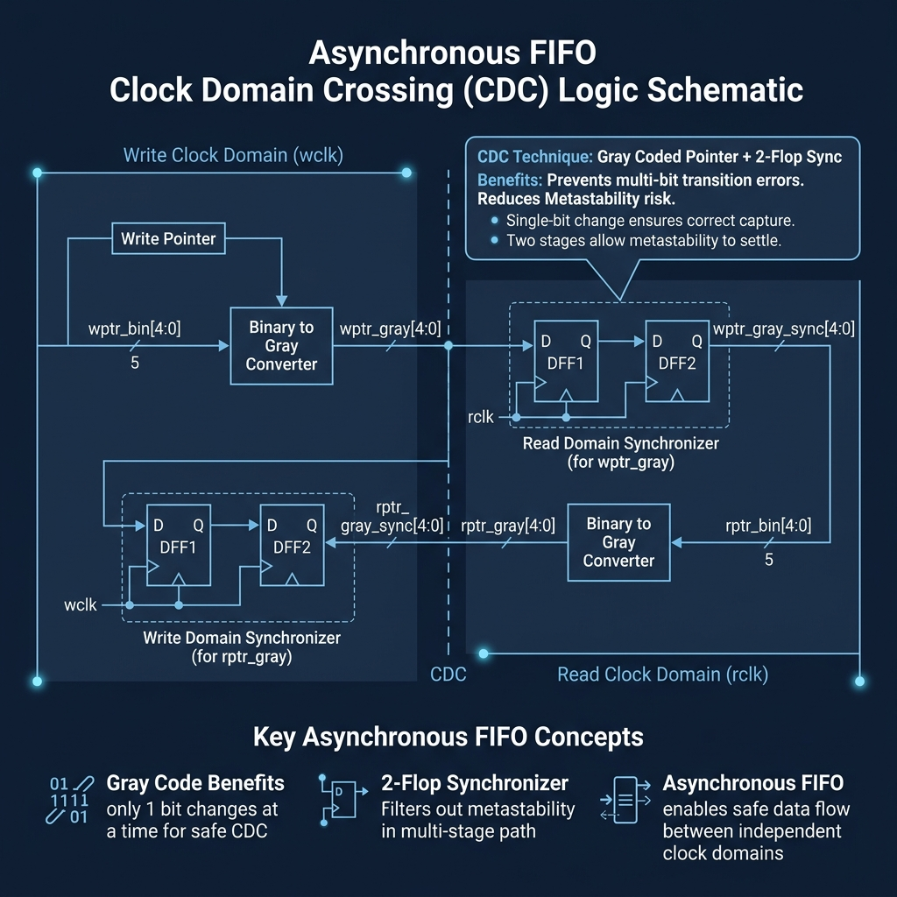
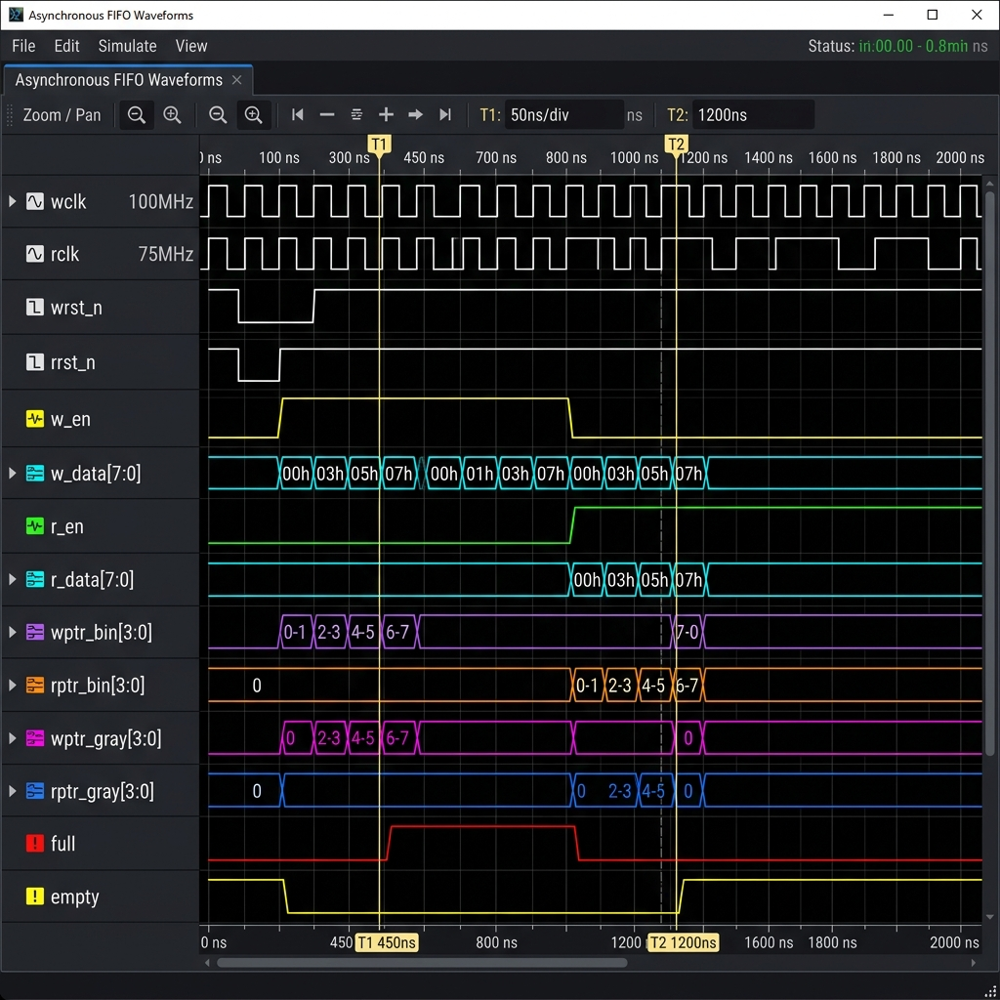

# Synchronous & Asynchronous FIFO with Clock Domain Crossing (CDC)


## 📝 Project Summary

Designed parameterizable synchronous and asynchronous FIFO modules with full/empty flag generation logic. Implemented Gray-code pointer synchronization in the async FIFO to safely cross clock domains, and verified read/write pointer wrap-around and boundary conditions with self-checking testbenches. CDC (Clock Domain Crossing) bugs are notoriously easy to miss in simulation and expensive in silicon — this project is direct evidence I've handled that class of problem correctly.

---

## 🏗️ Architecture & Waveforms

### CDC Logic
  
*Figure 1: 2-Flop Synchronizer and Gray-code logic for Async FIFO*

### FIFO Operation
  
*Figure 2: Full/Empty flag generation and pointer wrap-around*

---

## 🚀 How to Run the Simulation

### Prerequisites
- **SystemVerilog simulator**: Cadence Xcelium, QuestaSim / ModelSim, or Icarus Verilog
- **CDC-aware verification tools**: (optional but recommended)

### Run Steps
1. **Clone the repository:**
   ```bash
   git clone https://github.com/abhijit-karale/sync-async-fifo-cdc.git
   cd sync-async-fifo-cdc
   ```

2. **Navigate to simulation folder:**
   ```bash
   cd sim/
   ```

3. **Run synchronous FIFO tests:**
   ```bash
   make run_sync_fifo
   ```

4. **Run asynchronous FIFO tests (CDC):**
   ```bash
   make run_async_fifo
   ```

5. **View coverage reports:**
   ```bash
   cat coverage_sync.txt
   cat coverage_async.txt
   ```

---

## 📊 Coverage & Results

- **Synchronous FIFO**: Full coverage on read/write operations, full/empty flags, almost full/empty thresholds, and pointer wrap-around.
- **Asynchronous FIFO**: CDC safety verified using Gray-code pointer synchronization across asynchronous clock frequency ratios (100MHz vs 40MHz, 33MHz vs 100MHz).

### Key Achievements:
- Safe clock domain crossing using 2-flop synchronizers
- Verified full/empty flag integrity under asynchronous clock frequencies
- Pointer wrap-around handling at address boundaries
- Metastability-free synchronization across domains (0 Hamming distance errors detected by CDC assertion monitor)

---

## 📂 Project Structure

```
sync-async-fifo-cdc/
├── README.md
├── rtl/
│   ├── sync_fifo.sv
│   ├── async_fifo.sv
│   ├── gray_code.sv
│   ├── fifo_sync.sv
│   └── fifo_flags.sv
├── tb/
│   ├── sync_fifo_tb.sv
│   ├── async_fifo_tb.sv
│   ├── cdc_monitor.sv
│   └── fifo_sequences.sv
├── sim/
│   ├── Makefile
│   ├── run_sync.do
│   └── run_async.do
└── images/
    ├── cdc_logic.png
    └── fifo_waveform.png
```

---

## 🛠️ Tools & Technologies

- **RTL Design**: Verilog, SystemVerilog
- **Verification**: SystemVerilog, CDC-aware testbenches, Self-checking Scoreboards
- **Simulator**: Cadence Xcelium / QuestaSim / ModelSim / Icarus Verilog
- **CDC Techniques**: Gray-code synchronization, 2-flop synchronizers, Assertion-based Hamming distance checkers

---

## 📌 Clock Domain Crossing (CDC)

### Synchronous FIFO
- **Single Clock Domain**: Both read and write use same clock
- **Simple Pointer Comparison**: Direct full/empty detection

### Asynchronous FIFO
- **Dual Clock Domains**: Independent `rclk` and `wclk`
- **Gray-Code Synchronization**: Eliminates multi-bit transition glitches
- **2-Flop Synchronizers**: Metastability protection across domains
- **CDC Safety**: Proven safe pointer synchronization

---

## ✅ CDC Verification Checklist

- [x] Synchronization across clock domains
- [x] Gray-code pointer conversion (binary $\leftrightarrow$ Gray)
- [x] Metastability-free synchronization
- [x] Full/empty flag correctness
- [x] Pointer wrap-around (address boundary)
- [x] Data integrity across clock domains
- [x] Stress testing with frequency mismatch (2:1, 3:1 ratios)

---

## 🎓 CDC Design Principles Used

- **Gray-Code**: Only one bit toggles per clock cycle $\rightarrow$ no multi-bit sampling glitches
- **2-Flop Synchronizer**: Breaks metastability within 2 clock cycles
- **Registered Outputs**: Timing-safe flag generation
- **Separated Pointers**: Read and write pointers never cross without synchronization

---

## 📧 Contact

For questions about this project, feel free to reach out:
- **GitHub**: [abhijit-karale](https://github.com/abhijit-karale)
- **LinkedIn**: [abhijit-karale-rtl-dv](https://www.linkedin.com/in/abhijit-karale-rtl-dv)
- **Email**: abhijitkarale8@gmail.com
